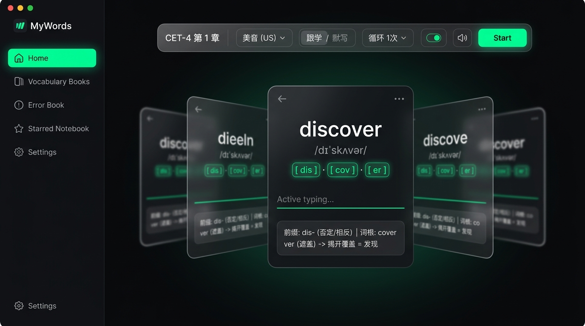
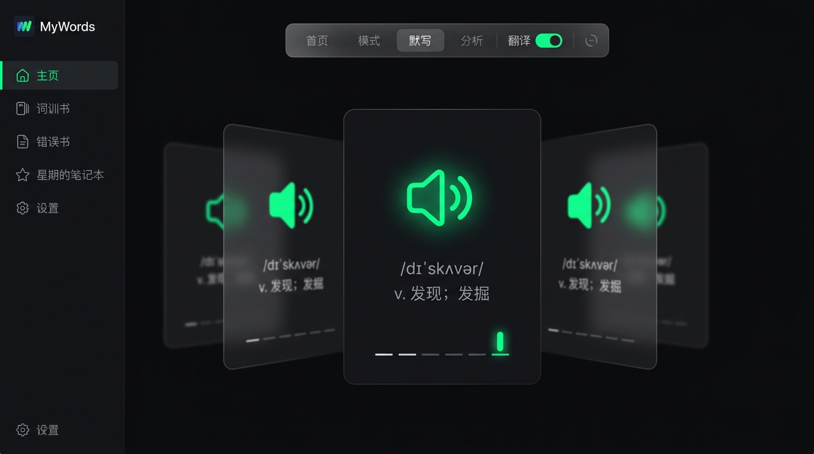
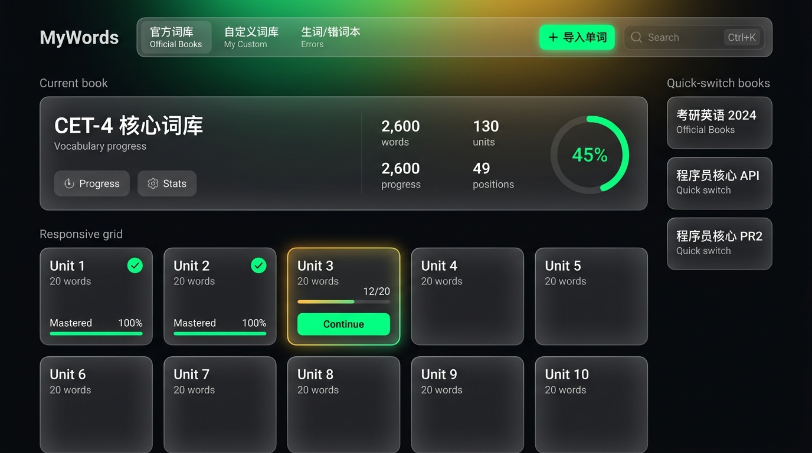
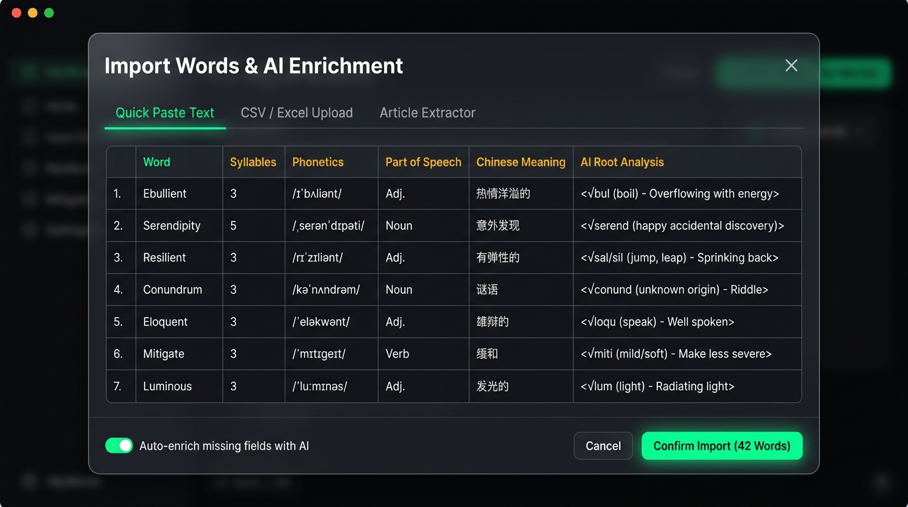
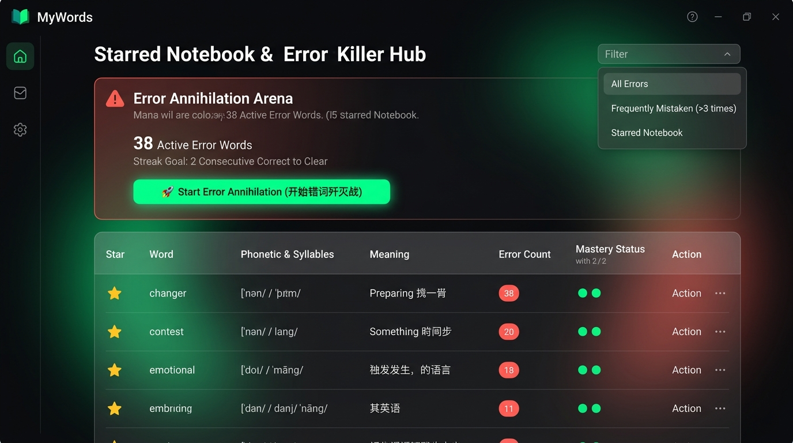
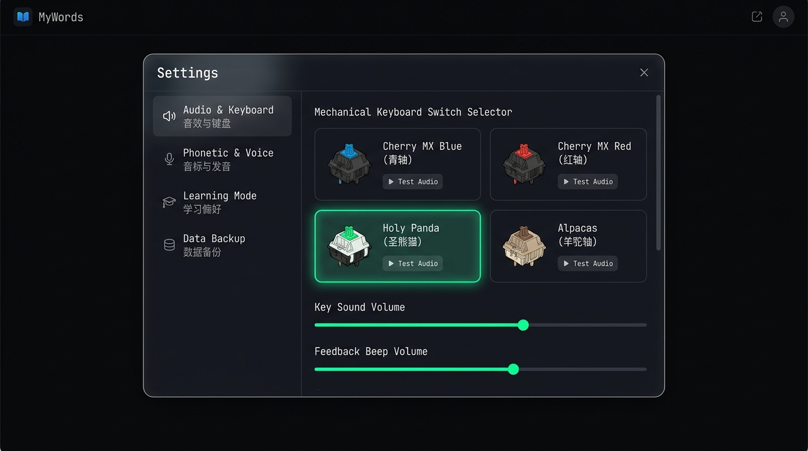
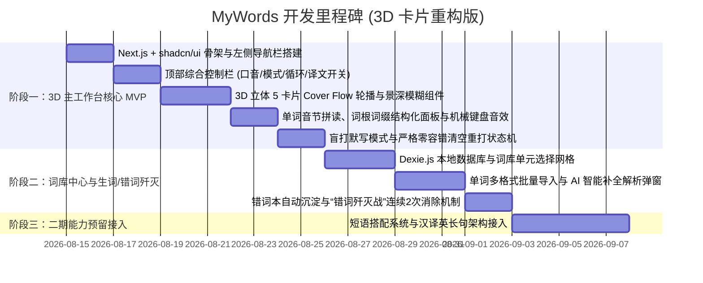

# 📖 MyWords（我的英语单词）产品需求文档 (PRD)

---

## 1. 文档基本信息

| 属性 | 内容 |
| :--- | :--- |
| **项目名称** | MyWords（我的英语单词） |
| **文档版本** | v2.0.0 (3D立体卡片与全页面重构版) |
| **产品定位** | 专为深度英语学习者打造的**3D音节拼读、构词法拆解、肌肉记忆与闭环默写**应用 |
| **核心愿景** | **“会读、会写、会背，永久记住一个单词”** —— 剔除花哨的击键速度打点，专注语言记忆与默写攻克 |
| **视觉风格** | 参考 **[EasyBuild.pro](https://easybuild.pro/)** 风格：极深黑曜石底色 (`#0B0C0E`) + 赛博荧光绿 (`#00FF88`) + 琥珀黄 (`#FEBC2E`) + 磨砂玻璃拟态 (`bg-white/[0.06] backdrop-blur-xl`) + **3D 景深模糊卡片轮播 (3D Cover Flow)** |
| **主要技术栈** | `Next.js 14/15` (App Router) + `TypeScript` + `Tailwind CSS` + `shadcn/ui` + `framer-motion (3D Transforms)` + `Zustand` + `Dexie.js (IndexedDB)` + `Howler.js` |

---

## 2. 需求全景与功能架构

```mermaid
graph TD
    A[MyWords 核心系统] --> M1[1. 首页: 3D立体卡片工作台]
    A --> M2[2. 词库与单元体系]
    A --> M3[3. 生词本与错词本]
    A --> M4[4. 单词多维知识呈现]
    A --> M5[5. 拼写与闭环默写引擎]
    A --> M6[6. 机械键盘音效系统]
    A --> M7[7. 二期规划预留]
    A --> M8[8. 全页面视觉与布局规范]

    M1 --> M1_1[左侧全局菜单导航]
    M1 --> M1_2[中间顶部综合控制栏]
    M1 --> M1_3[3D立体5卡片景深轮播 Cover Flow]
    M1 --> M1_4[前缀/词根/后缀深度结构化拆解]

    M2 --> M2_1[词库管理与内置词库]
    M2 --> M2_2[单元划分与进度管理]
    M2 --> M2_3[多格式单词导入与智能补全]

    M3 --> M3_1[生词本收藏与专属攻克]
    M3 --> M3_2[错词本自动沉淀与歼灭机制]

    M4 --> M4_1[英美双音标与重音高亮]
    M4 --> M4_2[音节切分 Syllables 与自然拼读]
    M4 --> M4_3[词根词缀构词法推导]

    M5 --> M5_1[跟学模式 vs 盲打默写模式]
    M5 --> M5_2[零容错清空重打机制]
    M5 --> M5_3[本章错词尾部闭环重考]
```



---

## 3. 首页与主工作台核心需求（重大升级）

---

### 3.1 左侧全局菜单导航 (Left Sidebar)
- **固定竖向常驻栏**（采用 `#0B0C0E` / `#12141A` 磨砂玻璃质感）：
  - **品牌 Logo**：`MyWords`（赛博荧光绿 `#00FF88` 发光图标）。
  - **核心导航菜单**：
    - 🏠 **主页 (Home)**：进入 3D 单词打字与默写工作台。
    - 📚 **词库 (Vocabulary Books)**：词库管理、单元列表与单词导入。
    - ⚠️ **错词本 (Error Book)**：错词频次排行与错词歼灭战。
    - ⭐ **生词本 (Starred Notebook)**：加星难词收藏夹与专属特训。
    - ⚙️ **设置 (Settings)**：机械键盘轴体试听、音标发音偏好、每单元容量等。
  - **激活态动效**：当前选中的菜单项呈现荧光绿胶囊背景与柔和外发光。

---

### 3.2 中间区域顶部综合控制栏 (Center Header Toolbar)
参考用户实机控制栏布局设计，集成完整的全局控制能力：
1. **词书与单元标识**：展示当前选中的词库与章节（如 `CET-4  第 1 章`），点击可呼出单元快速切换抽屉。
2. **发音口音下拉切换**：`美音 (US)` / `英音 (UK)` 一键切换，附带自动发音开关图标。
3. **学习模式切换 (Mode Switcher)**：
   - **跟学模式 (Learn & Follow)**：看词、音标、音节与词根，跟打练习。
   - **默写模式 (Blind Dictation)**：遮蔽英文单词，通过中文释义/发音纯盲打。
4. **单词循环次数配置 (Word Loop Count)**：
   - 支持设置单个单词需正确敲击的次数：`循环 1次`（默认）、`循环 2次`、`循环 3次`、`循环 5次`。
   - 用户敲完一次后卡片原地重置，直到满足循环次数才切入下一词。
5. **译文显示/隐藏开关 (Translation Toggle)**：
   - 快速 Switch 开关：即使在默写模式下，也可以一键隐藏或显示中文释义，支持“纯听音默写”。
6. **辅助功能按键**：
   - 机械键盘按键音开关 🔊、暗黑/主题切换 🌙、快捷键提示 ⌨️、设置齿轮 ⚙️。
7. **`Start / 练习中` 状态主按钮**：
   - 赛博荧光绿主按钮，点击即刻聚焦输入并开始计时。

---

### 3.3 中间区域：3D 立体 5 卡片叠加轮播 (3D Cover Flow Carousel)
突破传统扁平呆板的单卡片展示，采用 **3D 空间立体透视与景深模糊（Depth of Field Blur）** 渲染：

```
                    ┌─────────────────────────┐
                    │      [ 活跃中心卡片 ]    │
                    │       清晰 / 100% 缩放   │
  ┌─────────────┐   │   立体无旋转 / 聚焦高亮  │   ┌─────────────┐
  │ [前第2张]   │   │                         │   │ [后第1张]   │   ┌─────────────┐
  │ 向左倾斜    │   └─────────────────────────┘   │ 向右倾斜    │   │ [后第2张]   │
  │ 景深模糊5px │   ┌─────────────────────────┐   │ 景深模糊3px │   │ 向右大幅倾斜 │
  │ 75% 缩放    │   │ [前第1张] 向左倾斜/模糊 │   │ 85% 缩放    │   │ 景深模糊5px │
  └─────────────┘   └─────────────────────────┘   └─────────────┘   └─────────────┘
```

1. **5 张卡片空间层叠架构**：
   - **当前中间卡片 (Active Center Card)**：
     - 尺寸最大（`scale(1.0)`），位于最上层（`z-index: 30`），无旋转（`rotateY(0deg)`），画面极其清晰锐利，外圈带有荧光绿/琥珀黄呼吸光晕。
   - **左侧两张卡片 (Left 1 & Left 2 - 已学单词)**：
     - `Left 1`：沿 Y 轴向左旋转 `rotateY(35deg)`，缩小为 `scale(0.85)`，位移并在背景施加 `filter: blur(3px)`，透明度 `0.7`。
     - `Left 2`：沿 Y 轴向左旋转 `rotateY(45deg)`，缩小为 `scale(0.72)`，施加 `filter: blur(6px)`，透明度 `0.4`。
   - **右侧两张卡片 (Right 1 & Right 2 - 即将到来的单词)**：
     - `Right 1`：沿 Y 轴向右旋转 `rotateY(-35deg)`，缩小为 `scale(0.85)`，施加 `filter: blur(3px)`，透明度 `0.7`。
     - `Right 2`：沿 Y 轴向右旋转 `rotateY(-45deg)`，缩小为 `scale(0.72)`，施加 `filter: blur(6px)`，透明度 `0.4`。
2. **切词 3D 丝滑过渡动效**：
   - 用户完成当前单词后，借助 `framer-motion` 执行 3D 轴向平滑旋转滑动，左侧卡片依次左滑出栈，右侧卡片顺滑旋转向前补位成为新的中心焦点卡片。

---

### 3.4 单词卡片内部多维结构化展示

#### A. 跟学模式（Learn Mode）卡片内部结构：
1. **单词拼写与音标**：如 `discover`，音标 `/dɪˈskʌvər/`。
2. **自然拼读音节切分 (Syllable Pills)**：
   - 拆解为 `[ dis ] · [ cov ] · [ er ]` 独立胶囊块，击键与音节实时高亮聚焦。
3. **跟练敲击输入区 (Active Typing Line)**：
   - 实时反馈当前敲击字母，光标实时推进。
4. **单词精细结构化拆解区 (Prefix / Root / Suffix Breakdown - 核心重点)**：
   - 在输入区下方以深色半透明面板结构化展示词根词缀，例如单词 **`discover`**：
     - **前缀 (Prefix)**：`dis-`（表示“否定 / 相反 / 去除”）
     - **词根 (Root)**：`cover`（表示“覆盖 / 遮盖”）
     - **语义推导**：$\text{去除覆盖的东西} \rightarrow \text{揭开、发现、发掘}$
5. **词性与中文释义**：`v. 发现；发掘`。

#### B. 默写模式（Blind Dictation Mode）卡片内部结构：
1. **英文完全遮蔽**：单词拼写、音节、词根词缀全部隐藏。
2. **线索呈现**：中央展示巨大的荧光绿发音按钮 🔊 + 音标 `/dɪˈskʌvər/` + 中文释义 `v. 发现；发掘`。
3. **盲打输入槽**：字母占位下划线 `_ _ _ _ _ _ _ _` 与跳动的绿色光标。
4. **灵活隐藏**：若用户在顶部控制栏关闭了“译文开关”，中文释义也会隐藏，变为纯粹的“听音默写”。

---

## 4. 核心页面 UI 视觉效果图展示 (基于 EasyBuild 风格)

---

### 页面 1-A：3D 立体主工作台（跟学模式 - 3D Cover Flow）



* **设计亮点**：
  * 左侧垂直菜单栏常驻；
  * 顶部控制栏配备口音切换、模式切换、单个单词循环次数、译文开关与 Start 按钮；
  * 中间呈现 5 张 3D 景深模糊轮播卡片，中心卡片展示 `discover` 音节胶囊 `[ dis ] · [ cov ] · [ er ]` 与底部前缀/词根拆解。

---

### 页面 1-B：3D 立体主工作台（纯盲打默写模式）



* **设计亮点**：
  * 英文全部隐藏，中心卡片呈现超大发音喇叭、音标、中文释义与下划线盲打输入槽；
  * 两侧景深模糊卡片保持 3D 透视环绕，营造极强的沉浸心流感。

---

### 页面 2：词库与单元选择中心 (Vocabulary & Unit Hub)



* **设计亮点**：
  * 官方词库 / 自定义词库 / 错词本 Tab 切换；
  * 当前词库数据大看板（总词数、单元数、45% 环形进度条）；
  * 单元响应式网格（已通关对勾、在学单元琥珀黄发光边框与一键 Continue）。

---

### 页面 3：单词批量导入与 AI 智能解析弹窗 (Import & AI Enrichment Modal)



* **设计亮点**：
  * 快捷文本粘贴 / CSV 上传 / 文章生词提取三合一；
  * 结构化解析预览表格（自动补齐音节、音标、词性、中文释义与 AI 词根拆解）。

---

### 页面 4：生词本与错词歼灭中心 (Starred Notebook & Error Killer Hub)



* **设计亮点**：
  * 醒目的珊瑚红错词歼灭战看板，展示当前活跃错词数；
  * 一键发起 `🚀 Start Error Annihilation (开始错词歼灭战)`；
  * 表格记录每个单词的累计错误次数与连续正确 2 次消除进度点。

---

### 页面 5：偏好设置与机械键盘音效调音台 (Settings Studio)



* **设计亮点**：
  * 左侧垂直分类导航（音效键盘、音标发音、学习偏好、备份）；
  * 14 种机械键盘轴体选择矩阵（Cherry 青/红/茶/黑、圣熊猫等），配备实时敲击试听按钮与双音量滑块。

---

## 5. 核心数据模型与状态机定义 (TypeScript)

```typescript
// ==========================================
// 1. 单词与词根结构化模型
// ==========================================

export interface WordEtymology {
  prefix?: { form: string; meaning: string };   // 前缀 (如 { form: "dis-", meaning: "否定/相反" })
  root?: { form: string; meaning: string };     // 词根 (如 { form: "cover", meaning: "遮盖" })
  suffix?: { form: string; meaning: string };   // 后缀 (如 { form: "-y", meaning: "名词后缀" })
  derivation: string;                           // 语义推导 (如 "揭开覆盖 = 发现")
}

export interface WordItem {
  id: string;                                   // 唯一ID
  name: string;                                 // 拼写 (如 "discover")
  syllables: string[];                          // 音节切分 (如 ["dis", "cov", "er"])
  phoneticUk?: string;                          // 英音 (如 "/dɪˈskʌvə(r)/")
  phoneticUs?: string;                          // 美音 (如 "/dɪˈskʌvər/")
  posList: {                                    // 词性与释义
    pos: 'n.' | 'v.' | 'adj.' | 'adv.' | 'other';
    means: string[];                            // 如 ["发现", "发掘"]
  }[];
  etymology?: WordEtymology;                    // 前缀/词根/后缀结构化拆解
}

// ==========================================
// 2. 首页 3D 轮播与练习控制状态 (Zustand Store)
// ==========================================

export type PracticeMode = 'learn' | 'dictation';

export interface MainWorkspaceState {
  currentBookId: string;
  currentUnitIndex: number;
  activeWordIndex: number;                      // 当前激活的单词索引 (中心卡片)
  mode: PracticeMode;                           // 'learn' (跟学) | 'dictation' (默写)
  loopCountSetting: 1 | 2 | 3 | 5;              // 单个单词循环次数
  currentWordRemainingLoops: number;            // 当前单词还需敲击次数
  isTranslationVisible: boolean;                // 是否显示中文释义
  phoneticPreference: 'us' | 'uk';              // 口音偏好
  isAutoPlayAudio: boolean;                     // 是否自动发音
  
  // 3D 轮播辅助计算: 获取当前窗口内的 5 张卡片数据 [left2, left1, center, right1, right2]
  getSurroundingWords: () => (WordItem | null)[];
  
  // 动作
  nextWord: () => void;
  prevWord: () => void;
  setMode: (mode: PracticeMode) => void;
  toggleTranslation: () => void;
  setLoopCount: (count: 1 | 2 | 3 | 5) => void;
}
```

---

## 6. 实施路线图与阶段规划



---

### 💡 总结
本次升级已将你的最新需求**（左侧常驻导航、顶部综合控制栏、前缀/词根/后缀结构化拆解、默写模式译文显隐、以及极其惊艳的 3D 立体 5 卡片景深轮播）**全部化为严谨的业务规范与高清设计图，所有图片已保存至本地 `./docs/images/`。
